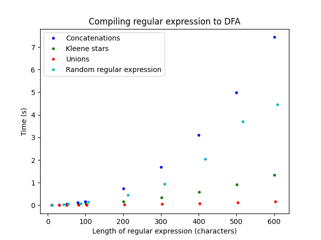
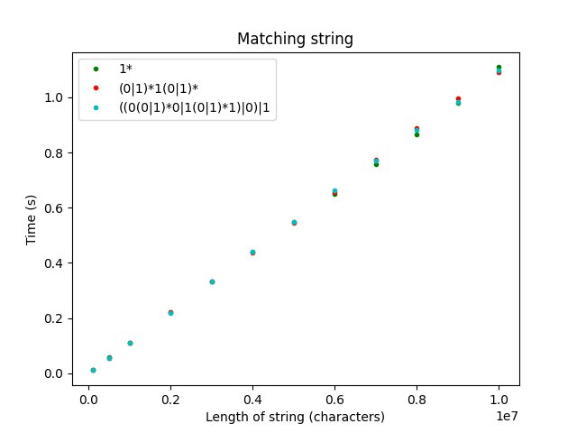

# Testausdokumentti

Ohjelman pystyy jakamaan seuraaviin peräkkäisiin toimintoihin:
1. Parsiminen: parsitaan säännöllinen lauseke syntaksipuuksi
2. Thompsonin algoritmi: muunnetaan syntaksipuu äärelliseksi epädeterministiseksi automaatiksi
3. Rabin–Scottin konstruktio: muunnetaan äärellinen epädeterministinen automaatti äärelliseksi deterministiseksi automaatiksi
4. Merkkijonon tarkastaminen: tarkastetaan äärellistä determinististä automaattia vasten, kuuluuko merkkijono säännöllisen lausekkeen muodostamaan kieleen.

## Parsinnan testaaminen
Parsinnan testaaminen on suoritettu yksikkötesteillä. Testitapaukset löytyvät testikansion tiedostosta [parser_test.py](../src/tests/parser_test.py). Jäsentimen testaamissa perusperiaatteena jäsentimelle annetaan syötteeksi säännöllinen lauseke merkkijonona, minkä jälkeen tarkastetaan, tuottiko jäsennin oikean jäsennyspuun. Yksikkötesteissä jokaiselle tiedostossa [props.py](../src/props.py) esitetylle säännölle, missä säännön vasen puoli on `empty`, `kleene`, `concatenation` ja `union`, on muodostettu oma yksikkötesti. Lisäksi on muodostettu yksi yksikkötesti säännöille, joissa vasen puoli on `single`, sillä kaikki nämä säännöt ovat käytännössä samanlaisia ainoana erona päätesymbolina käytetty merkki. Kaiki sallitut säännöllisen lausekkeen aakkoston merkit testataan kollektiivisesti kolmessa eri testitapauksessa.

Koska jäsentimessä oikean lopputuloksen saaminen riippuu joissain tapauksissa siitä, onko säännöllisessä lausekkeessa shift-toimenpiteessä juuri pinoon pushatun merkin jälkeen oleva seuraava merkki asteriski, *, eivät edellä mainitut sääntöihin perustuvat yksikkötestit eivät kata kaikkia mahdollisia tapauksia. Tällaisia ovat tilanteet, joissa säännöllisessä lausekkeessa konkatenaation jälkimmäisenä operandina on kaksinkertainen Kleenen tähti tai yhdisteen Kleenen tähti. Jokaiselle tällaiselle tilanteelle on tehty oma testitapaus, eli tilanteille, joissa konkatenaation ensimmäisenä operandina on tyhjä merkkijono, yksittäinen merkki, konkatenaatio, yhdiste tai Kleenen tähti ja toisena operandina kaksinkertainen Kleenen tähti tai yhdisteen Kleenen tähti.

Kaikki tilanteet, joissa yhdisteen jälkimmäinen operandi sisältää sulkuja, eivät myöskään sisälly edellä mainittujen yksikkötestien kattavuuteen. Näille tilanteille on tehty omat testitapaukset, ja näitä on esimerkiksi tilanteet, joissa yhdisteen jälkimmäinen operandi on yhdisteen Kleenen tähti tai kahden yhdisteen konkatenaatio.

## Thompsonin algoritmin testaaminen
Thompsonin algoritmin testaaminen on suoritettu yksikkötesteillä. Thompsonin algoritmi toimii rekursiivisesti perustuen jäsennyspuun solmun tyyppiin, joka voi olla tyhjä merkkijono, yksittäinen merkki, yhdiste, konkatenaatio tai Kleenen tähti. Yksikkötesteissä on oma testitapaus jokaiselle tyypille. Testitapauksissa muodostetaan tyyppiä vastaava jäsennyspuu, joka annetaan syötteenä Thompsonin algoritmille, ja testataan, muodostiko algoritmi jäsennyspuuta vastaavan NFA:n. NFA:sta tarkistetaan, NFA:n tilat, siirtymät sekä alkutila ja hyväksyvä tila.

## Rabin–Scottin algoritmin testaaminen
Rabin–Scottin algoritmi testaaminen on suoritettu yksikkötesteillä. Testitapauksissa syötteenä annetaan NFA ja tarkistetaan, tuottiko algoritmi oikean DFA:n. Testitapaukset on tehty seuraaville NFA:ille:
* NFA, joka sisältää kaksi tilaa, ja näiden välillä epsilon-siirtymä
* NFA, joka sisältää kaksi tilaa, ja näiden välillä tavallisen siirtymän
* NFA, joka sisältää yhdestä tilasta kaksi siirtymää
* NFA, joka sisältää kaksi peräkkäistä siirtymää
* NFA, joka sisältää silmukan

## Merkkijonon tarkastamisen testaaminen
Merkkijonon tarkastaminen on suoritettu yksikkötesteillä. Lisäksi merkkijonojen tarkastuksesta on tehty myös integraatiotestaus.

Yksikkötestauksessa muodostetaan DFA, ja DFA:n funktiolla `match` testataan, kuuluuko merkkijono DFA:n muodostamaan kieleen. Testitapaukset on tehty seuraaville DFA:ille:
* DFA, joka sisältää kaksi tilaa, ja näiden välillä siirtymä
* DFA, joka sisältää tilan, josta lähtee kaksi siirtymää
* DFA, joka sisältää kaksi peräkkäistä siirtymää ja hyväksyvän tilan viimeisessä tilassa
* DFA, joka sisältää kaksi peräkkäistä siirtymää ja hyväksyvän tilan keskimmäisessä tilassa
* DFA, joka sisältää silmukan

Integraatiotestauksessa muodostetaan säännöllinen lauseke, joka käännetään DFA:ksi. DFA:n funktiolla `match` testataan, kuuluuko merkkijono säännöllisen lausekkeen muodostamaan kieleen. Tämä kattaa siis käytännössä ohjelman kaikki neljä vaihetta. Testitapaukset on tehty suhteellisen yksinkertaisille säännöllisille lausekkeille, kuten esimerkiksi säännöllinen lauseke `(a|b)*`.

Lisäksi testitapauksia on tehty seuraaville monimutkaisemmille säännöllisille lausekkeille, jossa säännöllisen lausekkeen muodostaman kielen aakkosto on {0, 1}:
* kieli sisältää vain yhden kerran merkin 1
* kieli sisältää vähintään yhden kerran merkin 1
* kieli sisältää osamerkkijonon 001
* kieli sisältää vain parillisen pituiset merkkijonot
* kieli sisältää merkkijonot, jotka alkavat ja päättyvät samalla merkillä

Näissä testataan kaikki 0–4 merkin mittaiset merkkijonot.

## Muut yksikkötestaukset

Yksikkötestejä on tehty luokille `Node`, `NFA` ja `DFA`.

Luokan `Node` osalta on testattu solmun muodostaminen jokaisella eri tyypillä. Testitapaukissa muodostetaan solmu, ja katsotaan, onko lopputulos oikein.

Luokkien `DFA` ja `NFA` osalta on testattu tilojen sekä siirtymien lisäämiset automaattiin. Kummaltakin luokalta tilojen osalta testataan yhden ja kahden tilan lisääminen sekä yhden, kahden ja kolmen siirtymän lisääminen. Lisäksi luokalta `NFA` on testattu tilojen indeksien korottaminen, sekä epsilon-sulkeumat ja siirtymät.

Lisäksi on testattu luokan  `NFA` ulkopuoliset, mutta NFA:n muodostavat funktiot `empty()`, `single()`, `concatenation()`, `kleene` ja `union`. Näissä testataan, muodostavatko kyseiset funktiot oikeanlaiset NFA:t.

Luokan `DFA` metodin `match` testaus on esitetty osiossa [merkkijonon tarkastamisen testaaminen](#merkkijonon-tarkastamisen-testaaminen).

## Suorituskykytestaus
Suorituskykytestaus on tehty säännöllisen lausekkeen kääntämiselle DFA:ksi sekä merkkijonon tarkastamiselle säännöllisen lausekkeen muodostamaan kieleen.

Säännöllisen lausekkeen kääntämisessä on muodostettu erilaisia säännöllisiä lausekkeita, jotka ovat neljää eri tyyppiä:
* ainoastaan konkatenaatioita sisältävä säännöllinen lauseke 
* ainoastaan Kleenen tähtiä sisältävä säännöllinen lauseke
* ainoastaan yhdisteitä sisältävä säännöllinen lauseke
* satunnainen säännöllinen lauseke

Testitapauksissa katsottiin, kuinka paljon aikaa kuluu säännöllisen lausekkeen kääntämiseen verrattuna säännöllisen lausekkeen sisältämien merkkien pituuteen. Tulokset on esitetty kuvassa 1.

**Kuva 1**: Kääntämiseen kulunut aika säännöllisen lausekkeen merkkien määrän funktiona

Merkkijonon tarkastamisessa on luotu seuraavat säännölliset lausekkeet
* `1*`, mikä tahansa määrä ainoastaan merkkiä 1
* `(0|1)*1(0|1)`, vähintään kerran merkki 1 ja mikä tahansa määrä merkkiä 0
* `((0(0|1)*0|1(0|1)*1)|0)|1`, merkeistä 0 ja 1 koostuvat merkkijonot, jotka alkavat ja päättyvät samalla merkillä

Jokaista säännöllistä lauseketta testattiin pelkästään merkeistä 1 koostuvilla merkkijonoilla.

Testitapauksissa katsottiin, kuinka paljon aikaa kuluu merkkijonon testaamiseen verrattuna merkkijonon pituuteen. Tulokset on esitetty kuvassa 2.

**Kuva 2**: Merkkijonon tarkastamiseen kulunut aika merkkijonon merkkien määrän funktiona