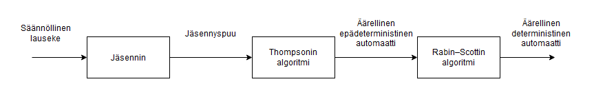
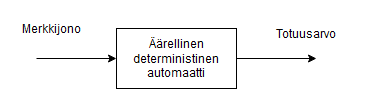

# Totetusdokumentti

## Yleisrakenne

Ohjelma kääntää syötteenä saadun säännllisen lausekkeen äärelliseksi epädeterministiseksi automaatiksi, jota vasten voidaan tarkastaa, kuuluuko syötteenä annettu merkkijono säännöllisen lausekkeen muodostamaan kieleen. Kääntäminen koostuu seuraavista peräkkäisistä toiminnoista:
1. Jäsentäminen
2. Thompsonin algoritmi
3. Rabin–Scottin algoritmi

Kääntämisen vaiheet on esitetty kuvassa 1. Ohjelma saa syötteeksi säännöllisen lausekkeen tavallisena merkkijonoa. Jäsennin jäsentää säännöllisen lausekkeen jäsennyspuuksi. Thompsonin algoritmilla jäsennyspuusta muodostetaan äärellinen epädeterministinen automaatti (NFA). Rabin–Scottin algoritmi muuntaa äärellisen epädeterministisen automaatin äärelliseksi deterministiseksi automaatiksi (DFA). 

**Kuva 1**: Kääntämisen vaiheet säännöllisestä lausekkeesta DFA:ksi.

Merkkijonon tarkastaminen säännöllistä lauseketta vasten on esitetty kuvassa 2. Rabin–Scottin algoritmin muodostama DFA on olio, joka on luokan `DFA` ilmentymä. Olio sisältää metodin `match`, jolla merkkijonon tarkastus tehdään. Metodi `match` antaa paluuarvona totuusarvon.

**Kuva 2**: Merkkijonon tarkastaminen säännöllistä lauseketta vasten.

### Jäsennin

* Syöte: säännöllinen lauseke
* Tuloste: jäsennyspuu

Jäsennin on bottom-up shift-reduce -tyyppinen.

### Thompsonin algoritmi

* Syöte: jäsennyspuu
* Tuloste: äärellinen epädeterministinen automaatti

TODO

### Rabin–Scottin algoritmi

* Syöte: äärellinen epädeterministinen automaatti
* Tuloste: äärellinen deterministinen automaatti

TODO

### Merkkijonon tarkastaminen

Merkkijonon tarkastus tapahtuu luokan `DFA` funktiolla `match`.

## Saavutetut aika- ja tilavaativuudet

TODO

## Lähteet
* Aho, Alfred V.; Lam, Monica S.; Sethi, Ravi; Ullman, Jeffrey D. 2007. Compilers : Principles, Techinques & Tools. 2. painos. ISBN 0-321-49169-6.
* Sipser, Michael. 1997. Introduction to the Theory of Computation. 1. painos. ISBN 0-534-94728-X